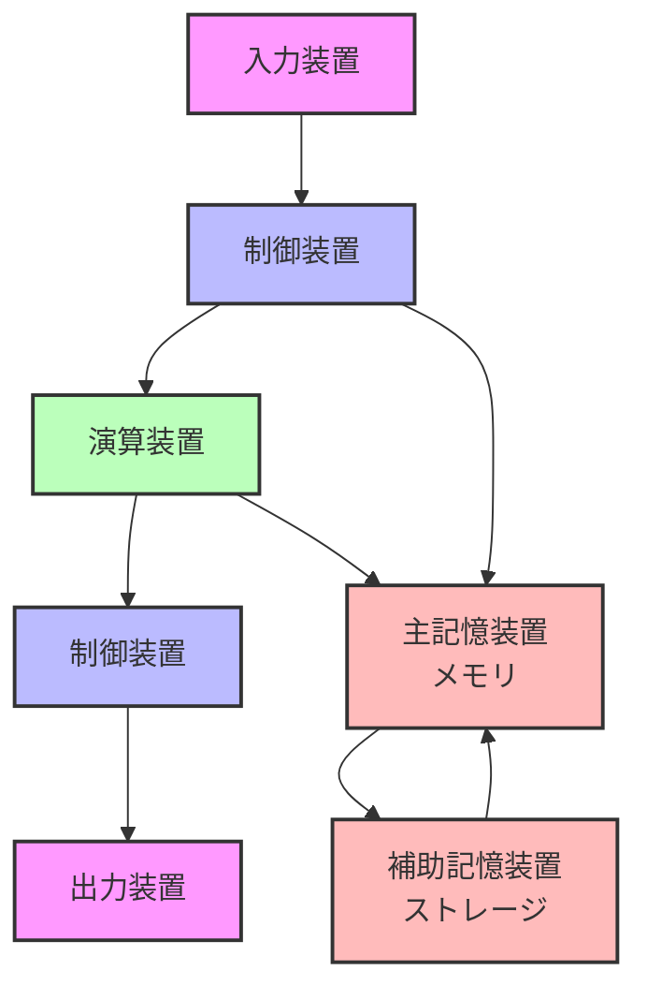

# PCの5大装置とWebサービス開発：基礎知識と実践

## はじめに

基本情報で学習するPC5台装置が、実務のWeb開発でどのように使われ、どのような考慮をしなければいならないのか考えてみました！

## PCの5大装置とは

コンピュータは以下の5つの主要な装置で構成されています：

各装置の役割について説明します。

1. **入力装置**
   - コンピュータにデータを入力するための装置
   - 代表的な例：キーボード、マウス、タッチパッド
   - その他：カメラ、マイクなども入力装置として機能

2. **出力装置**
   - コンピュータの処理結果を表示する装置
   - 代表的な例：ディスプレイ、プリンター、スピーカー
   - ユーザーへの情報提示を担当

3. **記憶装置**
   - データを保存する装置で、2種類に分類されます
   - 主記憶装置（メモリ）
     - 一時的な記憶領域として機能
     - 電源を切るとデータは消去される
     - 高速なアクセスが可能
     - 例：RAM（Random Access Memory）
   - 補助記憶装置（ストレージ）
     - 永続的な記憶領域として機能
     - 電源を切ってもデータは保持される
     - メモリよりアクセス速度は遅いが、大容量の保存が可能
     - 例：HDD、SSD

4. **演算装置（CPU）**
   - コンピュータの中核となる処理装置
   - 計算や処理を担当
   - 例：Intel Core i7、AMD Ryzen
   - 性能が高いほど処理速度が向上

5. **制御装置（CPUの一部）**
   - 各装置の連携を管理する制御装置
   - CPUに内蔵されている
   - システム全体の動作を調整

## Webサービスでの各装置の役割

Webサービスにおける各装置の役割について説明します。

1. **サーバー側**
   - 演算装置（CPU）
     - PHPプログラムの実行
     - データベースの処理
     - 複数ユーザーのリクエスト処理
   - 主記憶装置（メモリ）
     - 実行中のプログラムやデータの一時保存
     - システムの作業領域として機能
   - 補助記憶装置（ストレージ）
     - データベースの永続的な保存
     - ログファイルの保存
     - システムの記憶領域として機能

2. **クライアント側（ブラウザ）**
   - 入力装置
     - キーボード、マウスによる操作
   - 出力装置
     - ディスプレイへのWebページ表示
   - 主記憶装置
     - ブラウザのメモリ
     - JavaScriptの実行
   - 演算装置
     - JavaScriptの処理
     - ページのレンダリング

## メモリ使用量の計算と具体例

Webサービス開発では、メモリ使用量の計算が重要です。

1. **1リクエストあたりのメモリ使用量**
   - 基本的な使用量
     - PHPプログラムの実行：5-10MB
     - データベースクエリの結果：2-5MB
     - セッション情報：1-2MB
     - その他の処理：2-3MB
   - 合計：10-20MB/リクエスト

2. **メモリ使用量の計算**
   - 単純な計算
     - 例：100ユーザー × 20MB = 2GB
   - 実際の計算（最適化を考慮）
     - メモリの共有
       - 同じコードやライブラリは複数のプロセスで共有
       - 例：Laravelのフレームワークコードは1回だけメモリに読み込まれる。2回目は共有メモリとして管理される。
     - キャッシュの効果
       - データベースの結果をキャッシュ
       - セッション情報の共有
       - 静的ファイルのキャッシュ
     - ガベージコレクション
       - 使用していないメモリは自動的に解放
       - メモリの再利用が行われる
     - 実際の使用量
       - 理論値：100ユーザー × 20MB = 2GB
       - 実際の使用量：約1-1.5GB程度
       - キャッシュと共有により30-50%程度の削減

3. **具体的な使用例**
   - 一般的なWebアプリケーション
     - 1リクエストあたりのメモリ使用量：10-20MB
     - 同時接続ユーザー：100-200人
     - 必要なメモリ：約2-4GB
     - 実際の使用量：約1-2GB（最適化後）

## サーバースペックの選定

メモリ使用量の計算に基づいて、適切なサーバースペックを選定します。

1. **メモリ容量の決定**
   - 予測される最大メモリ使用量の1.5〜2倍程度を確保
   - 例：ピーク時2GB使用の場合、4GBのメモリを用意
   - 余裕を持たせることで、急な負荷増加にも対応可能

2. **推奨サーバースペック**
   - メモリ：8GB（余裕を持って）
   - CPU：2-4コア
   - ストレージ：50GB SSD
   - 例：AWS t3.medium、GCP e2-standard-2

3. **スケーリングの考慮**
   - 垂直スケーリング（サーバーの性能向上）
     - メモリ容量の増設
     - CPUの性能向上
   - 水平スケーリング（サーバー台数の増加）
     - ロードバランサーの導入
     - 複数サーバーでの分散処理

4. **注意点**
   - 上記は一般的な目安であり、実際の使用量はアプリケーションの特性により変動
   - キャッシュの効果により、実際のメモリ使用量は減少する可能性あり
   - 定期的な監視と調整が必要
   - スケーリングの容易さも考慮した選定が重要
